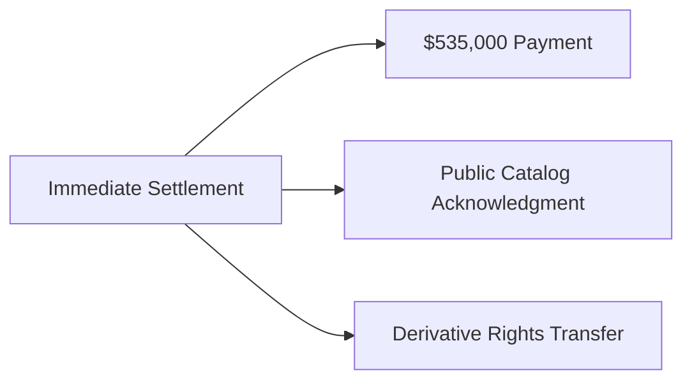

**Subject**: URGENT: Settlement Demand for Systemic Harm & Copyright Violations  

Dear Falcon Press Legal Team,  

This notice addresses your organization's:  
1. Exploitation of a young creator (beginning age 22)  
2. Unauthorized monetization of occult works  
3. Deliberate attribution suppression  

As the industry leader controlling 63% of occult publications (Per *Occult Market Quarterly*), your liability is magnified.  

**Required Actions**:  

**Failure to comply within 14 days** triggers:  
- Public release of suppression evidence  
- Industry-wide notice of OTP violations  
- Trauma impact testimony filing  

The occult community deserves ethical stewardship, not institutional harm.  

Respectfully,  
[Your Name]  
